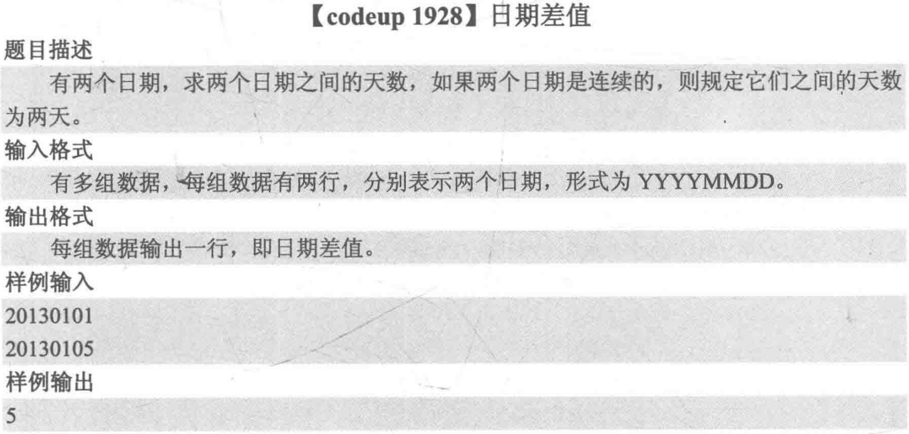
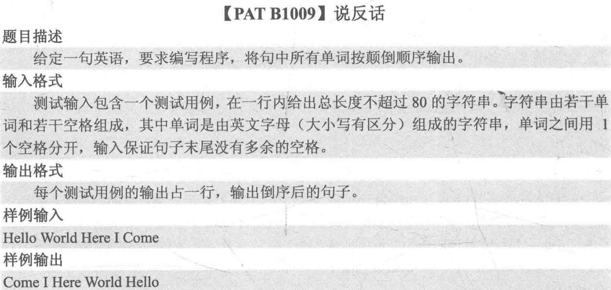
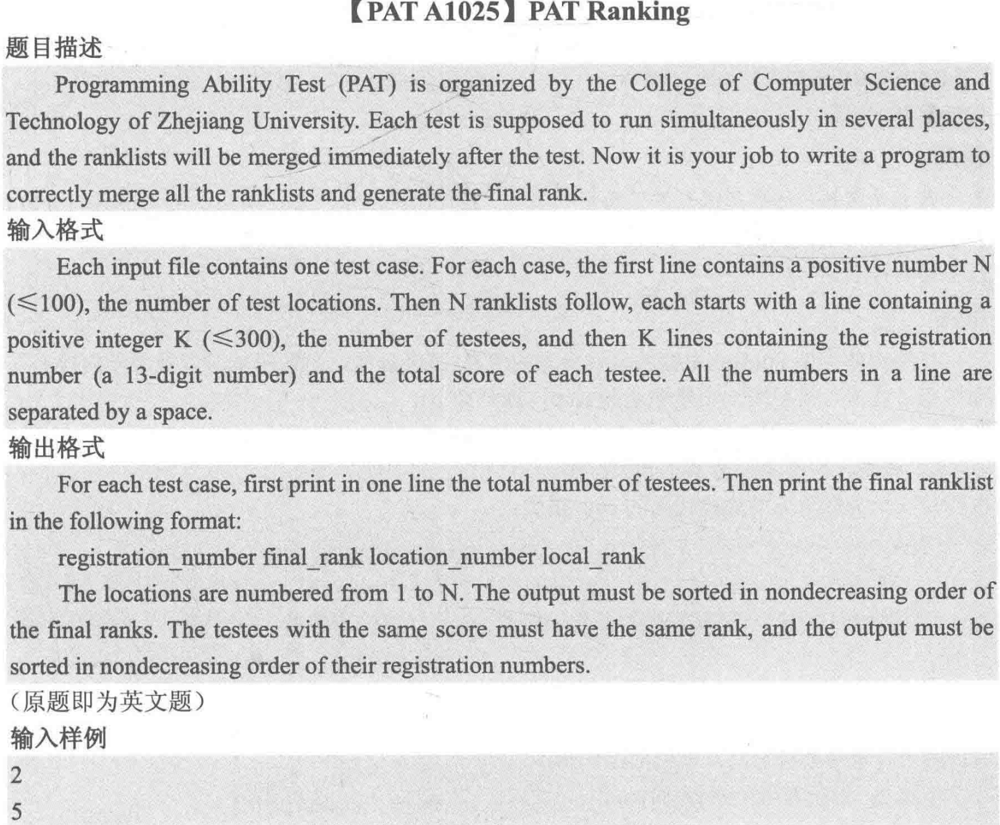
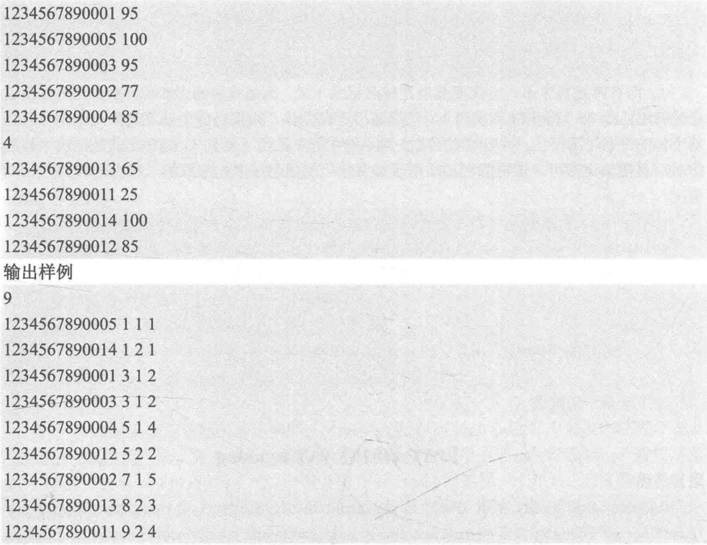
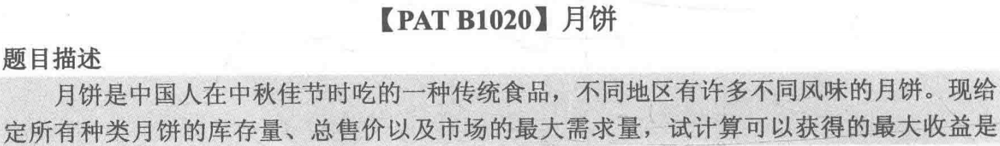
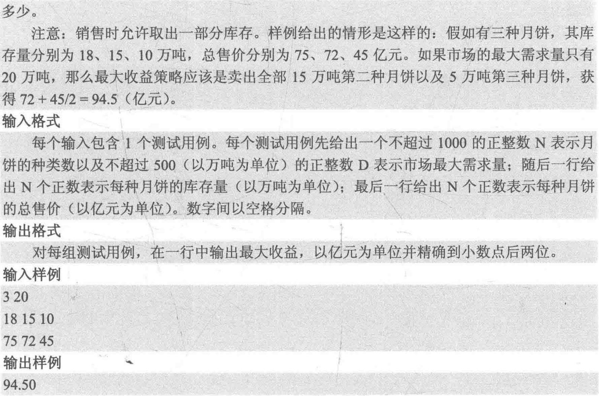
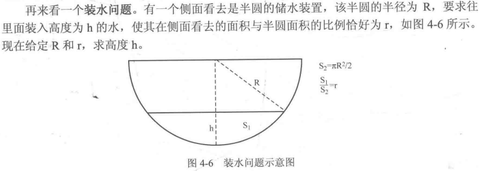

# 算法笔记记录

## 临时记录的一些

scanf和gets两者在接受字符串时：

1.不同点：
scanf不能接受空格、制表符Tab、回车等；对末尾回车符的处理：把回车符保留在缓存中。
而gets能够接受空格、制表符Tab和回车等；对末尾回车符的处理：接收回车，但把回车替换为\0.

2.相同点：
字符串接受结束后自动加'\0'。

## 入门模拟

- **日期处理**



```cpp
//!!!!!!!!!!!!!!!!!!!!!!!!!!!!!!!!!!!1
#include <cstdio>
using namespace std;
int month[12][2] = {{31, 31}, {28, 29}, {31, 31}, {30, 30}, {31, 31}, {30, 30}, 
                    {31, 31}, {31, 31}, {30, 30}, {31, 31}, {30, 30}, {31, 31}};
bool isLeap(int year)
{
    return ((year % 4 == 0 && year % 100 != 0) || (year % 400 == 0));
}
int main(int argc, char const *argv[])
{
    freopen("in.dat", "r", stdin);
    int date1, date2;
    int y1, y2;
    int m1, m2;
    int d1, d2;
    while (scanf("%d%d", &date1, &date2) != EOF)
    {
        if (date1 > date2)
        {
            int tmp = date1;
            date1 = date2;
            date2 = tmp;
        }
        y1 = date1 / 10000;
        y2 = date2 / 10000;
        /*m1=(date1-y1*10000)/100;
        m2=(date2-y2*10000)/100;
        d1=date1-y1*10000-m1*100;
        d2=date2-y2*10000-m2*100;*/
        //注意这里的处理方式
        m1 = (date1 % 10000) / 100;
        m2 = (date2 % 10000) / 100;
        d1 = date1 % 100;
        d2 = date2 % 100;
        int ans = 1;
        while (y1 < y2 || m1 < m2 || d1 < d2)
        {
            d1++;
            if (d1 == month[m1 - 1][isLeap(y1)] + 1)
            {
                m1++;
                d1 = 1;
            }
            if (m1 == 13)
            {
                y1++;
                m1 = 1;
            }
            ans++;
        }
        printf("%d", ans);
    }
    return 0;
}

```

思路总结：日期问题使用循环加一方法，对于月份的问题用二维数组解决。

- **进制转换**

```cpp
//将一个P进制数x转换为十进制数y
int y=0,product=1;
while(x!=0){
    y+=(x%10)*product;
    x/=10;
    product*=P;
}
//将一个十进制数y转换为Q进制数z
int z[40],num=0;
do{
    z[num++]=y%Q;
    y/=Q;
}while(y!=0);
```

- **说反话**



```cpp
#include <cstdio>
#include <cstring>
using namespace std;
const int maxn = 81;
char ans[maxn][maxn];
char str[maxn];

int main(int argc, char const *argv[])
{
    freopen("in.dat", "r", stdin);
    gets(str);
    int len = strlen(str), line = 0, col = 0;
    for (int i = 0; i < len; i++)
    {
        if (str[i] != ' ')
        {
            ans[line][col++] = str[i];
        }
        else
        {
            ans[line][col] = '\0';
            line++;
            col = 0;
        }
    }
    for (int i = line; i >= 0; i--)
    {
        printf("%s", ans[i]);
        if (i > 0)
            printf(" ");
    }
    //下面是更简洁的办法
    /*int num = 0;
    while (scanf("%s", str[num++]) != EOF)
        ;
    num -= 2;
    do
    {
        printf("%s", str[num--]);
        if (num >= 0)
        {
            printf(" ");
        }
    } while (num >= 0);*/

    return 0;
}

```

## 算法初步

下面是两个排序算法

```cpp
int A[maxn],n;
void selectSort()//选择排序
{
    for (int i = 0; i < n; i++)
    {
        int k = i;
        for (int j = i; j < n; j++) //记录i到n-1最小的元素
        {
            if (A[j] < A[k])
            {
                k = j;
            }
        }
        int tmp = A[i];
        A[i] = A[k];
        A[k] = tmp;
    }
}
void insertSort()//插入排序
{
    for (int i = 1; i < n; i++)
    {
        int tmp = A[i], j = i;
        while (j > 0 && tmp < A[j - 1])
        {
            A[j] = A[j - 1];
            j--;
        }
        A[j] = tmp;
    }
}
```

- **PAT Ranking**

这题的思路一开始没有整理好，需要多复习




```cpp
#include <cstdio>
#include <cstring>
#include <algorithm>
using namespace std;
struct STUDENT
{
    char num[14]; //ID
    int lnum;     //考场号
    int grade;    //分数
    //int frank;//总排名  //总排名最后一起输出就行
    int lrank; //考场排名
} stu[30000];
bool cmp(STUDENT a, STUDENT b)
{
    if (a.grade != b.grade)
        return (a.grade > b.grade); //nondecreasing
    else
        return (strcmp(a.num, b.num) < 0);
}
int main(int argc, char const *argv[])
{
    freopen("in.dat", "r", stdin);
    int n, id = 0;
    scanf("%d", &n);
    for (int i = 1; i <= n; i++)
    {
        int tmp;
        scanf("%d", &tmp);
        for (int j = 0; j < tmp; j++)
        {
            scanf("%s %d", stu[id].num, &stu[id].grade);
            stu[id++].lnum = i;
        }
        sort(stu + id - tmp, stu + id, cmp); //注意这里的处理
        stu[id - tmp].lrank = 1;
        for (int k = id - tmp + 1; k < id; k++)
        {
            if (stu[k].grade == stu[k - 1].grade)
            {
                stu[k].lrank = stu[k - 1].lrank;
            }
            else
            {
                stu[k].lrank = k + 1 - (id - tmp);
            }
        }
    }

    sort(stu, stu + id, cmp);
    int r = 1;
    printf("%d\n", id);
    for (int i = 0; i < id; i++)
    {
        if (i > 0 && stu[i].grade != stu[i - 1].grade)
        {
            r = i + 1;
        }
        printf("%s %d %d %d", stu[i].num, r, stu[i].lnum, stu[i].lrank);
        if (i != id - 1)
            printf("\n");
    }
    return 0;
}

```

- **hash表**
```cpp
#include <cstdio>
using namespace std;
char S[maxn][4], tmp[4];
int hashTable[26 * 26 * 26];
int hashFunc(char S[], int len)
{
    int id = 0;
    for (int i = 0; i < len; i++)
    {
        id = id * 26 + S[i] - 'A';
    }
    return id;
}
int main(int argc, char const *argv[])
{
    freopen("in.dat", "r", stdin);
    int n, m;
    scanf("%d%d", &n, &m);
    for (int i = 0; i < n; i++)
    {
        scanf("%s", S[i]);
        int id = hashFunc(S[i], 3);
        hashTable[id]++;
    }
    for (int i = 0; i < m; i++)
    {
        scanf("%s", tmp);
        int id = hashFunc(tmp, 3);
        printf("%d\n", hashTable[id]);
    }
    return 0;
}
```

- **字典序全排列**
```cpp
#include <cstdio>
//#include <cstring>
//#include <algorithm>
using namespace std;
const int maxn = 11;
int P[maxn], hashTable[maxn];
int n;
void func(int index) //现在正准备填P[index]
{
    if (index == n + 1) //在边界
    {
        for (int i = 1; i <= n; i++)
        {
            printf("%d", P[i]);
        }
        printf("\n");
        return;
    }
    for (int i = 1; i <= n; i++) //从1到n填入数字
    {
        if (hashTable[i] == false)
        {
            P[index] = i;
            hashTable[i] = true;
            func(index + 1);
            hashTable[i] = false;
        }
    }
}
int main(int argc, char const *argv[])
{
    freopen("in.dat", "r", stdin);
    n = 3;
    func(1);
    return 0;
}
```

- **八皇后的暴力法和回溯法**

```cpp
#include <cstdio>
#include <cmath>
//#include <cstring>
//#include <algorithm>
using namespace std;
const int maxn = 11;
int P[maxn], hashTable[maxn];
int n, count;
void generateP1(int index)
{
    if (index == n + 1)
    {
        bool flag = true;
        for (int i = 1; i <= n; i++)
        {
            for (int j = i + 1; j <= n; j++)
            {
                if (abs(i - j) == abs(P[i] - P[j]))
                {
                    flag = false;
                }
            }
        }
        if (flag)
        {
            count++;
        }
    }
    for (int i = 1; i <= n; i++)
    {
        if (hashTable[i] == false)
        {
            P[index] = i;
            hashTable[i] = true;
            generateP1(index + 1);
            hashTable[i] = false;
        }
    }
}
void generateP2(int index)
{
    if (index == n + 1)
    {
        count++;
        return;
    }
    for (int i = 1; i <= n; i++)
    {
        if (hashTable[i] == false)
        {
            bool flag = true;
            for (int pre = 1; pre <= index - 1; pre++)
            {
                if (abs(index - pre) == abs(i - P[pre]))
                {
                    flag = false;
                    break;
                }
            }
            if (flag)
            {
                P[index] = i;
                hashTable[i] = true;
                generateP2(index + 1);
                hashTable[i] = false;
            }
        }
    }
}
int main(int argc, char const *argv[])
{
    freopen("in.dat", "r", stdin);
    n = 8;
    count = 0;
    generateP1(1);
    printf("%d", count);
    count = 0;
    generateP2(1);
    printf("%d", count);
    return 0;
}
```

- **贪心**

卖月饼




```cpp
#include <cstdio>
//#include <cmath>
//#include <cstring>
#include <algorithm>
using namespace std;
const int maxn = 1010;

struct mooncake
{
    double store;
    double sell;
    double price;
} cake[maxn];
bool cmp(mooncake a, mooncake b)
{
    return (a.price > b.price);
}

int main(int argc, char const *argv[])
{
    freopen("in.dat", "r", stdin);
    int n;
    double D;
    scanf("%d%lf", &n, &D);
    int store[maxn], sell[maxn];
    for (int i = 0; i < n; i++)
    {
        scanf("%lf", &cake[i].store);
    }
    for (int i = 0; i < n; i++)
    {
        scanf("%lf", &cake[i].sell);
        cake[i].price = cake[i].sell / cake[i].store;
    }
    sort(cake, cake + n, cmp);
    double ans = 0;
    for (int i = 0; i < n; i++)
    {
        if (cake[i].store <= D)
        {
            D -= cake[i].store;
            ans += cake[i].sell;
        }
        else
        {
            ans += cake[i].price * D;
            break;
        }
    }
    printf("%.2f\n", ans);

    return 0;
}
```

- **区间贪心（活动选择）**

下面是N个活动的选择问题（区间不相交）

```cpp
#include <cstdio>
//#include <cstring>
//#include <cmath>
#include <algorithm>
using namespace std;
const int maxn = 110;
struct Inteval
{
    int x, y;
} I[maxn];

bool cmp(Inteval a, Inteval b)
{
    if (a.x != b.x)
        return (a.x > b.x);
    else
        return (a.y < b.y);
}

int main(int argc, char const *argsv[])
{
    //freopen("in.dat", "r", stdin);
    int N;
    while (scanf("%d", &N), N != 0) //逗号表达式取决于后面的值
    {
        for (int i = 0; i < N; i++)
        {
            scanf("%d%d", &I[i].x, &I[i].y);
        }
        sort(I, I + N, cmp);
        int ans = 1, lastX = I[0].x;
        for (int i = 1; i < N; i++)
        {
            if (I[i].y <= lastX)
            {
                lastX = I[i].x;
                ans++;
            }
        }
        printf("%d\n", ans);
    }
    return 0;
}

```

区间选点和区间不相交的区别就在于`if (I[i].y <= lastX)`改为`if (I[i].y < lastX)`，
因为区间选点（在按左端点从大到小的排序条件下）每次都要选左端点，
这样左端点和下一个考察区间的右端点就不能重合（重合就是两个区间有一个公共的点了）

- 一般的二分查找
```cpp
int binarySearch(int A[], int left, int right, int x)
{
    int mid;
    while (left <= right)/////////////
    {
        mid = (left + right) / 2;
        if (A[mid] == x)
        {
            return mid;
        }
        else if (A[mid] < x)
        {
            left = mid + 1;
        }
        else
        {
            right = mid - 1;
        }
    }
    return -1;
}
```

- 找第一个符合条件的元素
```cpp
int lower_bound(int A[], int left, int right, int x)
{
    int mid;
    while (left < right)////////////////
    {
        mid = (left + right) / 2;
        if (A[mid] >= x)
        {
            right = mid;
        }
        else
        {
            left = mid + 1;
        }
    }
    return left;
}
int upper_bound(int A[], int left, int right, int x)
{
    int mid;
    while (left < right)////////////////
    {
        mid = (left + right) / 2;
        if (A[mid] > x)
        {
            right = mid;
        }
        else
        {
            left = mid + 1;
        }
    }
    return left;
}
int solve(int A[], int left, int right, int x)//这是模板！
{
    int mid;
    while (left < right)////////////////
    {
        mid = (left + right) / 2;
        if ("条件成立")//第一个满足条件的元素的位置<=mid
        {
            right = mid;
        }
        else
        {
            left = mid + 1;
        }
    }
    return left;
}
```

- 二分法拓展

解决函数f(x)=0求解的问题

```cpp
const int eps = 1e-5;

double f(double x)
{
    return ...;
}
double solve(double L, double R)
{
    double left = L, right = R, mid;
    while (right - left > eps)
    {
        mid = (left + right) / 2;
        if (f(mid) > 0)
        {
            right = mid;
        }
        else
        {
            left = mid;
        }
    }
    return mid;
}
```

装水问题



```cpp
#include <cstdio>
#include <cmath>
using namespace std;
const double PI = acos(-1);
const double eps = 1e-5;

double f(double R, double h)
{
	double alpha = 2 * acos((R - h) / R);
	double L = 2 * sqrt(R*R - (R - h)*(R - h));
	double s2 = PI * R*R / 2;
	double s1 = alpha * R*R / 2 - L * (R - h) / 2;
	return s1 / s2;
}

double solve(double R, double r)
{
	double left = 0, right = R, mid;
	while (right - left > eps)
	{
		mid = (left + right) / 2;
		if (f(R, mid) > r)
		{
			right = mid;
		}
		else {
			left = mid;
		}
	}
	return mid;
}

int main()
{
	freopen("in.dat", "r", stdin);
	double R, r;
	scanf("%lf%lf", &R, &r);
	printf("%.4f\n", solve(R, r));
	return 0;
}
```